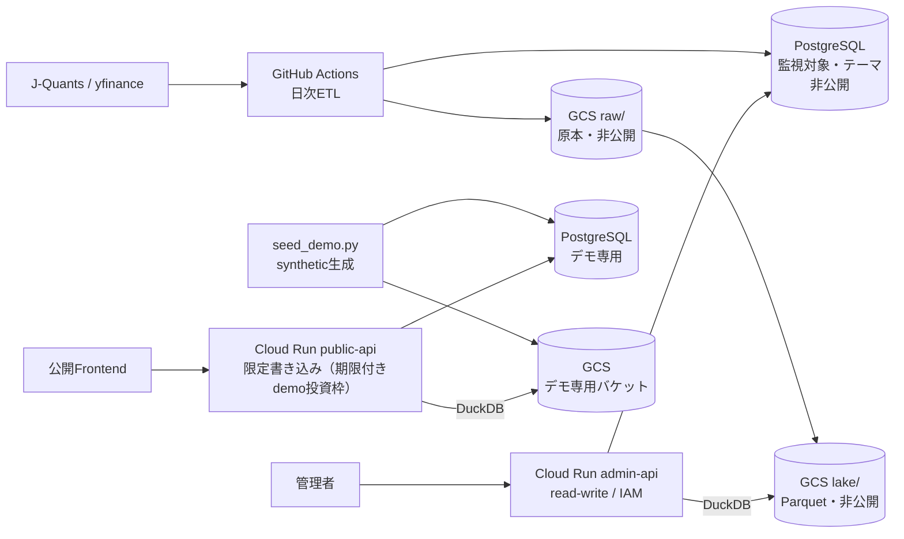

# Investment Monitoring Data Platform

投資判断に使う一次データを、**時点・取得元・取込実行まで追跡可能な形で蓄積する**データ基盤です。
現在は投資枠・テーマ・投資対象のMasterと、株価／財務開示のObservedを対象に、ETL、API、Web、
クラウド運用まで一貫して実装しています。

| | |
|---|---|
| 公開デモ | https://invest-monitoring-frontend-540015602390.australia-southeast1.run.app |
| 公開API | https://invest-monitoring-public-api-540015602390.australia-southeast1.run.app/docs |

どちらもCloud Runで稼働中。投資枠、テーマ、構成銘柄、株価、財務の実績・会社予想・開示履歴を
閲覧できます。**投資枠は実際に作成・編集できます**（架空データ環境で、作成1時間後にAPIから非表示となり、定期cleanupで物理削除）。

> **公開デモのデータはすべて架空です。** 市場データの利用条件（第三者への提供の禁止）を踏まえ、
> 公開環境には実データを置かず、synthetic dataを別環境に用意しています。実データを扱う環境は
> 非公開で、データ・認証情報・DBを公開側と共有しません。

## ポイント

| 観点 | 実装内容 |
|---|---|
| データ設計 | Master / Observed / Derivedを責務で分離し、一次観測へ判断結果を混在させない |
| ETL | 増分取得、冪等UPSERT、部分失敗、rate limit、raw保存、取込実行・エラー履歴 |
| API | FastAPIのRouter / Repository / ETLを分離。公開系と管理系を同一イメージ・異なる権限で運用 |
| Web | Next.jsで投資枠、ウォッチリスト、テーマ、株価、財務実績・会社予想・開示履歴を表示 |
| Cloud | Cloud Run、Neon PostgreSQL、GCS、Artifact Registry、Secret Manager、IAMを利用 |
| 運用 | GitHub ActionsによるCI/CD・日次ETL・バックアップ、readiness、復元検証 |
| 品質 | PostgreSQLを使うバックエンドテスト293件、フロントエンドテスト5件、型・lint・build検証 |

---

## WHY — 何のために作っているか

**意思決定そのものをデータモデル化したい**、というのが出発点です。何を見て、どう評価し、何を選び、
結果はどうだったか。これを記録し、後から検証できる形にしたいと考えました。

### なぜ投資を題材にしたか

意思決定を扱う領域は多くありますが、投資には次が揃っています。

- **データが比較的揃っている** — 株価・財務・開示が機械可読な形で入手できる
- **外部データで検証できる** — 判断の帰結が価格という客観的な系列で測れる
- **観測から効果検証まで一気通貫で追える** — 判断とその結果が同じ時間軸に乗る

`Context → Observation → Assessment → Decision → Action → Outcome → Learn` の閉ループを、
実データで一周させられる題材だと考えました。各層の定義は
[docs/data/design-principles.md](docs/data/design-principles.md) にあります。

### なぜデータ基盤が必要か

判断を検証するには、**その時点で何が見えていたか**を再現できなければなりません。結果を
知った後の値で振り返れば、判断の良し悪しは測れません。

ところが投資判断に使うデータは、株価や財務だけではありません。金利・為替・業界統計、
ニュース、決算イベント、需給、オルタナティブデータなど、仮説を検証する材料は複数の
データソースに分散しています。これらをテーマや銘柄と結びつけて使うには、まず
**一次データを来歴・時点・意味を失わず蓄積できる土台**が要ります。

この要件が、実装に具体的な制約を課します。

- **一次観測を上書きしない** — 訂正や再取得で過去の値が書き換わると、当時の判断を再現できない
- **取得元の採用規則を1か所に置く** — 画面とDerivedが別々に優先順位を持つと値が食い違う
- **rawまで遡れる** — 来歴が切れた時点で検証は成立しない
- **利用条件を構成で守る** — 公開環境に実データを置かず、権限そのものを分ける

### 現在の範囲

閉ループのうち、実装しているのは判断の**材料と前提**までです。

| 層 | 実装 |
|---|---|
| Context（投資方針・目的・制約） | 投資枠をversion管理し、有効期間つきで保持 |
| Observation（株価・財務・開示） | 取得元・取込実行・取得時点とともに蓄積 |
| Derived（リターン等） | Observationから再計算 |
| Assessment / Decision / Action / Outcome / Learn | これからの範囲 |

判断そのものを記録する層から先が、閉ループを閉じるために残っている部分です。

### North Star

材料を増やす方向では、マクロ指標、カタリスト、ニュース、オルタナティブデータを加え、

**「どの情報が、どのテーマ・銘柄・投資仮説に関係し、その時点で何を根拠に判断できたか」**

を構造化して扱える状態を目指します。ただし観測を横に広げるより、閉ループを一度閉じることを
先に置いています。判断と結果を突き合わせる経路が無いままデータを増やしても、検証はできません。

人間にもAIにも再利用可能な基盤を目指していますが、AI-readyとは単にデータをAIへ渡せることでは
なく、データの意味・対象・時点・来歴・加工過程を機械的に辿れる状態だと考えています。

---

## WHAT — 何を作ったか

### 現在できること

- **投資枠を管理する** — 目的・配分比率・期待リターン・許容ドローダウン・想定期間・
  ベンチマーク・レビュー周期をversion管理し、有効期間つきで履歴を残す
- **監視対象を管理する** — 全上場銘柄（約4,400）のマスタから検索して登録し、検討中／監視中／
  監視停止の状態で持つ。テーマ×投資対象の所属も期間で管理する
- **価格を増分取得する** — 取得元別の観測として保持し、同じ日に複数の取得元がある場合の
  採用規則を1か所で決める
- **財務開示を履歴として持つ** — 実績、会社予想、予想改訂を開示時点のまま保持する
- **来歴を辿る** — 分析層の値から取得元・取込実行・取得時点をたどり、GCS上のrawまで遡る
- **公開デモで入力を試せる** — 架空データ環境で、期限付きの投資枠だけ誰でも作成・編集できる。
  書き込める範囲をDBロールとHTTP層の両方で絞る
- **実データは非公開の管理APIから更新する**

### 今回のMVPに含めないもの

- 観測データの無条件保存
- 投資評価、売買判断（デモトレードによるフォワードテスト）、バックテスト、AIによる推論
- 複数ユーザー向けの認証・権限管理

これらは先回りして物理テーブルを作らず、必要性が確定した段階でObserved / Derived / Assessmentの
各責務へ追加します。

### アーキテクチャ概要

**rawが原本で、ParquetもPostgreSQLも派生です。** PostgreSQLは「何を監視しているか」を持ち、
Parquetは「その値がいくらだったか」を持ちます。価格と財務はParquetからしか読みません。

公開APIと管理APIは**同じイメージ・同じコード**を使い、Cloud Runサービス・DBロール・環境変数・IAMで権限を分けます。

**公開APIは実データへ物理的に到達できません。** 接続先のDBは架空データ専用で、GCSも別バケットです。
公開APIのサービスアカウントには実データのバケットへの権限を与えていないため、環境変数を
取り違えても実データは読めません。

### アプリケーション層（API）

FastAPIがテーマ、投資対象、価格、財務、取込実行履歴を提供します。

### データ層

データを責務で分離しています。

| 層 | 内容 | 状態 |
|---|---|---|
| Master | 何を観測・分類・投資するか | 実装済み |
| Observed | 外部から取得し正規化した一次観測（価格・財務開示） | 実装済み（GCS Parquet、全4,732銘柄・2年分） |
| Derived | Observedから再計算できる特徴量・リターン・リスク指標 | 着手（日次リターン、point-in-time PBR。計算定義が正本で結果は保存しない） |
| Assessment | 閾値・モデルによるバージョン付きの評価 | 未着手 |
| Decision | 評価を踏まえた意思決定 | 未着手 |
| Action | 注文・取消・約定など実際に行った取引 | 未着手 |
| Outcome | 損益・制約充足・仮説の成否など行動後の結果 | 未着手 |

### データフロー概要

外部API、ETL、分析層（Parquet / DuckDB）、Control Plane（PostgreSQL）、API、Webを分離し、
取得元から画面表示まで追跡できる構成にしています。

### DB設計概要

ER図、列の意味・粒度・単位、型・制約・インデックスを文書化しています。構造リファレンスとER図は
Alembic migrationから自動生成し、手書きのデータ定義書との不一致をCIで検出します。

---

## HOW — どう作ったか

### 技術スタック

| レイヤー | 技術 |
|---|---|
| バックエンド | Python 3.11 / FastAPI / psycopg |
| DB | PostgreSQL 17 / Alembic |
| フロントエンド | Next.js 16 / TypeScript / Tailwind CSS |
| 分析層 | GCS Parquet / DuckDB / pyarrow |
| データ取得 | J-Quants API / yfinance |
| インフラ | Cloud Run / Cloud Storage / Artifact Registry / Secret Manager / IAM / Neon |
| CI/CD | GitHub Actions（lint・型・テスト・Dockerビルド / deploy / 日次ETL / backup） |

### 設計上の判断

一般的な規約ではなく、**このプロジェクト固有の判断**を残しています。

- **既存ツールと競合する機能は作らない** — 高機能チャートや全銘柄スクリーナーは既存サービスを利用し、本プロジェクトではデータの統合・来歴管理・投資仮説との関連付け・事後検証に集中する
- **データの利用条件を環境分離で担保する** — 市場データの再配布を避けるため、公開デモは架空データ専用のDBとGCSバケットを別に置く。公開APIのサービスアカウントに実データのバケットへの権限を与えないので、設定を取り違えても実データは読めない。運用の注意ではなく構成で守る
- **評価・判断を観測Factに混ぜない** — 閾値や判定結果をFactテーブルに持たせると、ルールを変えるたびにFactを作り直すことになる
- **SQLアクセスを集約する** — Routerはドメインモデルを扱い、SQLはRepositoryまたはデータ更新処理へ集約する
- **価格・財務とアプリ状態を分離する** — 価格・財務はGCS / Parquetに集約し、DuckDB経由でFastAPIへ提供する。PostgreSQLは「何を監視し、どの枠で運用しているか」（投資枠・テーマ・監視対象・構成）だけを持つ。**読み出し経路は1本**で、公開デモも同じコードを通る
- **一次観測の採用規則を1か所に置く** — 同じ日に複数の取得元がある場合にどちらを採るかは `preferred_price` という単一の定義に寄せる。APIとDerivedが別々に優先順位を持つと、画面の終値と計算されたリターンが食い違う
- **欠損をゼロで埋めない** — 未提供・非開示・対象外はすべて `NULL`。IFRSに経常利益が無いことと、値がゼロであることを区別する
- **推測で実装しない** — 外部APIの項目名や制限は実レスポンスで確認し、回帰テストで固定してから実装する

### データ品質・トレーサビリティ

- **一次観測を上書きしない** — 取得元が違う同じ日付は別行として保持する。どちらを採るかは読み出し側の規則で決め、一次観測そのものは消さない
- **訂正開示を残す** — 決算の訂正は開示番号が違えば別レコードとし、元の開示を書き換えない
- **来歴を辿れる** — 取得元、取込実行、取得時点、原レコードのハッシュを記録し、DB値からrawまで遡れる
- **価格の意味を混在させない** — `price_basis`を必須にし、調整済み、未調整、由来不明を区別する
- **再実行で重複させない** — ETLを冪等にし、同じ入力を再取得しても行を増やさない
- **回復可能な部分失敗を記録する** — 1銘柄の失敗で全体を止めず、`ingestion_error`に理由と再試行可否を残す

### 品質の担保

| | |
|---|---|
| テスト | バックエンド293件（実PostgreSQLに対して実行） / フロントエンド5件 |
| CI | PRとmainへのpushで lint・型・テスト・Dockerビルドを実行 |
| ドキュメント整合 | スキーマとデータ定義書の乖離を**CIで検出**。更新漏れはテストが落ちる |
| バックアップ | イミュータブルバックアップを日次取得し、**復元を実際に検証** |

テストは構造ではなく振る舞いを検証します（「テーブルが存在する」ではなく「再実行しても行が増えない」）。

---

## ドキュメント

| | |
|---|---|
| システム構成・権限境界 | [docs/architecture.md](docs/architecture.md) |
| データ層の論理設計 | [docs/data/design-principles.md](docs/data/design-principles.md) |
| 列の意味・粒度・単位 | [docs/data/schema-data-dictionary.md](docs/data/schema-data-dictionary.md) |
| 型・制約・ER図（自動生成） | [docs/data/schema-reference.md](docs/data/schema-reference.md) |
| 取得元の選択・利用条件 | [docs/data/sources.md](docs/data/sources.md) |
| セットアップ・検証 | [docs/development.md](docs/development.md) |
