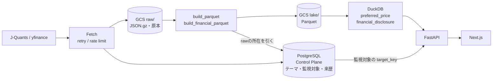
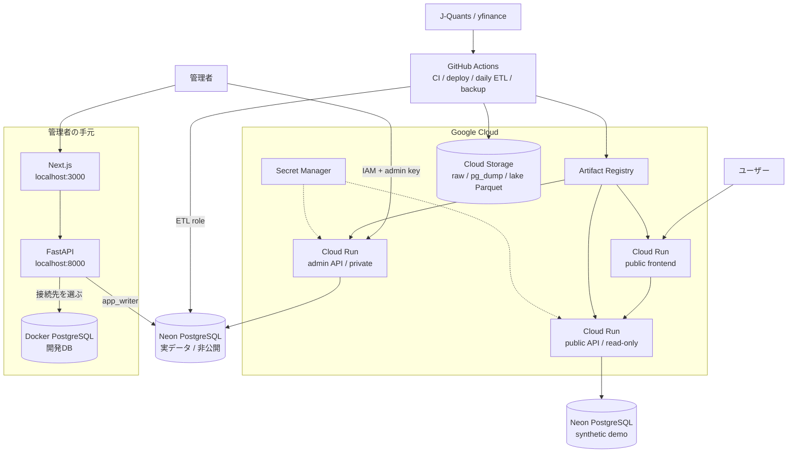

# アーキテクチャ

この文書は、データフロー、実行環境、権限境界、FastAPI内部の責務をまとめたシステム構成の正本です。
列定義や取得元の選択は扱いません。

## 全体データフロー

外部APIから取得したデータは**まずrawとして保存**し、そこからParquetを組み立てます。
rawが原本で、ParquetもPostgreSQLも派生です。

**PostgreSQLとParquetは役割が違います。** PostgreSQLは「何を監視しているか」を持ち
（Control Plane）、Parquetは「その値がいくらだったか」を持ちます（Data Plane）。
価格と財務はParquetからしか読みません。

公開デモには外部取得データを流しません。**同じコードを通し**、別バケットのsynthetic
Parquetと別PostgreSQLだけを参照します。分離はコードの分岐ではなくバケットの権限で
担保します。

| 層 | 責務 | 主な実装 |
|---|---|---|
| 外部データ | 原データの提供 | J-Quants、yfinance |
| 取得・ETL | 取得、raw保存、来歴記録 | Python、GitHub Actions |
| 分析層 | 正規化、Parquet構築、Derivedの計算 | pyarrow、DuckDB |
| Control Plane | 監視対象・テーマ・構成・取込メタデータ | PostgreSQL |
| アプリケーション | データアクセス、HTTP提供、画面表示 | FastAPI、Next.js |

## 実行環境

| サービス | 役割 |
|---|---|
| Cloud Run | Next.jsとFastAPIのコンテナを実行する |
| Artifact Registry | デプロイ対象のDockerイメージを保管する |
| Secret Manager | DB接続URLと管理キーを実行時に渡す |
| GCS | rawレスポンス、`pg_dump`、分析層のParquetを保管する |
| Neon PostgreSQL（実データ） | ETLと認証済み管理操作が更新する正本。公開しない |
| Neon PostgreSQL（デモ） | 公開APIが読むsynthetic data。実データと認証情報を共有しない |
| GitHub Actions | CI、build、deploy、日次ETL、バックアップを自動化する |

## 公開・管理・開発環境の境界

公開APIと管理APIは同じDockerイメージを使い、Cloud Runサービス、環境変数、DBロール、IAMを
変えて運用します。公開APIはアプリ側のread-only guardとDB側のread-only roleを重ねます。

| 環境 | 接続先 | 公開範囲 | HTTP操作 | DB権限 |
|---|---|---|---|---|
| public | syntheticデモDB | 一般公開 | GET / HEAD / OPTIONS | SELECTのみ |
| admin | 実データDB | 管理者のみ | CRUD | `app_writer`の限定的な読み書き |
| daily ETL | 実データDB | 非公開 | バッチ | `etl_writer`の対象テーブル更新 |
| migration | 実データDB | 非公開 | Alembic | Owner権限 |
| local | Docker PostgreSQL | localhost | CRUD | 開発用権限 |
| local admin | 実データDB | localhost | CRUD | `app_writer`。接続先を明示したときだけ |
| CI | workflow内PostgreSQL | workflow内 | テスト中のみ | テスト用権限 |

管理APIはCloud Run IAMと`X-Admin-Key`で保護し、管理用Secretをブラウザへ埋め込みません。スキーマ変更は
日次ETLやアプリ起動時に行わず、リリース時にAlembicを明示実行します。

**実データを編集する経路は2つあります。** 現在使っているのは手元のNext.jsとFastAPIを経由する経路で、
ブラウザから実データDBへ`app_writer`で書き込みます。Cloud Runの管理APIはIAM認証を必要とするため
ブラウザから直接は呼べず、リモートから管理するためのUIはまだありません。どちらの経路でもロールは
`app_writer`に揃えてあり、スキーマは変更できません。

**ローカルの接続先は`backend/.env`で選びます。** 開発DBと実データDBのどちらにも繋げますが、
実データへ繋ぐときのロールは`app_writer`に限定し、ローカルからスキーマを壊せないようにしています。
CRUDはできても`CREATE TABLE`・`DROP TABLE`・`TRUNCATE`はすべて`permission denied`で止まります。

接続先は画面上部のバナーが常時表示します。開発DBと実データDBで画面の見た目は変わらないため、
表示が無いと実データを開発だと思って編集する事故が起きます。

開発DBと本番DBのデータは自動同期しません。同期するのはAlembicで管理するスキーマだけです。
本番相当データが必要な場合も、本番から開発へ一方向に復元し、開発DBを本番へアップロードしません。

## 保存責務

| データ | 正本・保存先 | 書き手 |
|---|---|---|
| 実データのMaster / Observed | 実データPostgreSQL | 日次ETL、認証済み管理API |
| 公開デモデータ（戦略・テーマ・銘柄・構成） | デモPostgreSQL | `seed_demo.py` |
| 公開デモデータ（価格・財務） | GCS `invest-demo-lake` Parquet | `seed_demo.py --publish` |
| DBバックアップ | GCS `postgres-backups/` | GitHub Actions |
| API rawレスポンス | GCS `raw/` | GitHub Actions |
| 全市場Observed / Derived | GCS `lake/` Parquet | `build_parquet.py` / `build_financial_parquet.py` |
| ローカル開発データ | Docker PostgreSQL volume | ローカルAPI、開発者 |

GCSはライフサイクルで保持方針を固定します。**`raw/`は削除しません。**原本であり、
PostgreSQLもParquetもここから作り直せるためです。`postgres-backups/`は365日で削除します。

| プレフィックス | 90日 | 365日 |
|---|---|---|
| `raw/` | Nearline | Coldline（削除しない） |
| `postgres-backups/` | Nearline | 削除 |

**バックアップの価値は移行で上がります。** 観測データをDWHへ逃がすと、PostgreSQLに残るのは
テーマ・投資対象・構成・判断という**手で入れたデータだけ**になります。価格や財務はrawとAPIから
作り直せますが、「なぜこの銘柄をこのテーマに入れたか」はどこにも無く、失うと戻りません。

PostgreSQLはアプリケーション状態、GCS Parquetは価格・財務ObservedとAnalyticalという責務分離に従います。判定基準は
[データ層の設計原則](data/design-principles.md)の「保存先の責務分離」が正本です。

**価格と財務の読み出し経路は1本で、常に分析層（Parquet）を読みます。**
`market_price_observation` / `financial_disclosure` / `financial_summary` を読むコードは
置きません（`app/repositories/price_source.py`、`financial_source.py`）。
公開デモも同じ経路を通します。
配備によってPostgreSQLとParquetを選ぶ二本立てにすると、採用する観測の選び方の答えが2つに
なり、さらに**公開デモが本番で使わない経路を動かす**ことになるためです。

実データとデモの分離は、コードの分岐ではなく**バケットの権限**で担保します。

| 配備 | 読むバケット | サービスアカウント |
|---|---|---|
| 管理API（非公開） | `invest-dwh-db-storage` | `invest-admin-runtime@` |
| 公開API | `invest-demo-lake` | `invest-public-api-runtime@` |

公開APIのサービスアカウントは実データのバケットに権限を持たないため、`PARQUET_LAKE`
を取り違えても実データは読めません。安全を環境変数の正しさに依存させません。

分析層へ繋がらない場合もアプリは起動します。価格と財務が出ないだけの障害を全機能の停止に
化けさせないためです。`/ready` が `analytics: unavailable` を返し、価格と財務の
エンドポイントは503になります。

DuckDB接続はアプリのlifespanで1つ持ち、起動時に温めます。都度張り直すと1リクエストあたり
2.8秒かかりますが、使い回せば0.15秒です。

残りは日次ETLのPostgreSQLロードの廃止と、読まれなくなったテーブルの削除です。
PostgreSQLには戦略、テーマ、監視対象、関係、設定、取込メタデータを残します。DuckDB / dbtでDerivedやmartを生成し、
GitHub Actionsで実行時間、再試行、並列性が不足した場合だけ、バッチ実行先を
Cloud Run Jobs等へ交換します。

責務分離の判断基準と、段階移行のうち未了の部分は
[データ層の設計原則](data/design-principles.md#目標の物理データフロー)を正本とします。

## FastAPI内部の責務

| コンポーネント | 責務 |
|---|---|
| Router | HTTP入力、認証結果、レスポンスモデルを扱う |
| Repository | PostgreSQLへの検索・CRUDを扱う |
| 更新スクリプト | 外部取得、raw保存、正規化、検証、ロードを扱う |
| `/api/data` | 更新処理の起動と`ingestion_run`の参照を扱う |

RouterへSQL、ETL、投資判断ロジックを置きません。`/api/data`も処理本体を持たず、更新スクリプトへ
委譲します。稼働中のエンドポイントと入出力仕様はFastAPIが生成するOpenAPIを正本とします。

## FrontendをCloud Runへ置く理由

Backend、Artifact Registry、Secret Manager、IAM、ログ確認がGoogle Cloudにあるため、Frontendも
Cloud Runへ置き、build、deploy、権限、障害調査の運用境界を集約しています。現在はVercel固有の
Preview DeploymentやEdge Runtimeを必要としていません。これらが要件になった場合だけ、Frontendの
配置先を再評価します。
