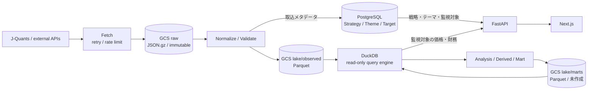

# 投資データ基盤の目標アーキテクチャ

## 位置づけ

この文書は現在と将来に共通する論理データ層の境界を定めます。物理スキーマの正本は
[Alembic migration](../../backend/migrations/versions/)、列定義の正本は
[`schema-data-dictionary.md`](schema-data-dictionary.md)です。

## 共通意思決定モデルとの対応

本プロジェクトは、個人開発全体で共通する
`Context → Observation → Assessment → Decision → Action → Outcome → Learn`の閉ループを、
投資判断へ具体化します。共通モデル自体はプロジェクト外で管理し、この文書では投資ドメイン固有の
対応と、共通モデルを実装可能なデータ責務へ分解した結果だけを定義します。

| 共通モデル | 投資判断プラットフォームでの対応 |
|---|---|
| Context | 投資方針、戦略、目的、制約、判断主体、評価時点 |
| Observation | 株価、財務、開示、イベント、およびそれらの取得時点・来歴 |
| Derived | リターン、成長率、ボラティリティ、ファクター等の再計算可能な値 |
| Assessment | テーマ・銘柄・Evidenceのバージョン付き評価、予測、スコア |
| Decision | 採用、見送り、売買など、候補から何を選んだか |
| Action | 発注、取消、その他の実行指示と実行行為 |
| Outcome | 約定、損益、状態変化、仮説の事後的な帰結 |
| Learn | 予測・判断・結果の差を検証し、評価定義やルールを更新する処理 |

共通モデルは概念上の正本、コード・Alembic・この文書は投資プロジェクトで採用済みの実装上の正本です。
両者に差がある場合、共通モデルへ機械的に合わせて既存実装を変更せず、差分と移行要否を先に評価します。


## 設計原則

データを次の責務に分離します。

1. **Master** — 何を観測・分類・投資するか
2. **Observed** — 外部から取得し、内部形式へ正規化した一次観測
3. **Derived** — Observedから再計算可能な特徴量、リターン、リスク指標、ファクター
4. **Assessment** — 閾値・モデル・ルールによるバージョン付きの評価・解釈
5. **Decision** — Assessmentを踏まえた人またはシステムの意思決定
6. **Outcome** — 注文、約定、入出金、手数料など実際に発生した取引事実

外部提供者が加工した値でも、この基盤が外部入力として取得したものはObservedとします。
自基盤内で生成した値だけをDerivedとします。

## 保存先の責務分離

上の6層は**意味の境界**です。これとは別に、**保存先の境界**を持ちます。両者は独立しており、
同じObservedでも置き場所が分かれます。

| | PostgreSQL | GCS Parquet |
|---|---|---|
| 役割 | Operational（アプリケーション状態を管理する） | Observed / Analytical（履歴を蓄積して参照・分析する） |
| 置くもの | Master、戦略、テーマ、監視対象、設定、取込メタデータ | 価格・財務履歴、全市場のObserved、Derived、mart |
| アクセス | 参照と更新。整合性制約が効く | 追記中心。列指向でスキャンする |
| 実装状況 | 実装済み | 未実装 |

**判定基準は「自分のデータか、外部データか」ではありません。** 外部由来でも、`data_source` や
「この銘柄を監視するか」のように**現在の状態を管理するもの**はPostgreSQLに置きます。逆に自分が
生成したデータでも、大量に追記して分析するだけのものはParquetが適します。

問うのは次の2点です。

1. **状態として管理し、更新し、整合性を保つ必要があるか** → PostgreSQL
2. **大量の履歴を追記し、横断して集計したいか** → Parquet

この分離により、PostgreSQLはWebアプリケーションが管理する状態へ限定できます。価格・財務などの
外部Observedは監視対象分も含めてGCS Parquetへ集約し、DuckDB経由で参照します。Assessment / Decision /
Outcomeを追加するときは、状態と関係を持つ本体をPostgreSQL側に置き、その計算入力・特徴量・大量履歴を
Parquet側に置きます。

なお**Parquetは正本ではありません**。原本はGCSへイミュータブルに保存したrawであり、Parquetは
rawから再生成できる状態を保ちます。

### 目標の物理データフロー

価格・財務の本体はPostgreSQLへ蓄積せず、rawと正規化済みParquetをGCSへ保存します。DuckDBは永続化先ではなく、GCS上のParquetを読み取る
参照・分析エンジンとして利用します。FastAPIはPostgreSQLのアプリケーション状態とDuckDBの価格・財務を
API層で統合し、Next.jsへ同一の契約で提供します。



| 保存・実行先 | 責務 | 正本性 |
|---|---|---|
| GCS `raw/` | APIレスポンス原本、取得時点の証跡、再処理元 | 取得原本・証跡の正本 |
| GCS `lake/observed/` | 型・識別子・時点を統一した全市場の価格・財務Parquet | rawから再生成可能な分析用データセット |
| GCS `lake/marts/` | リターン、期間集計、ファクター等の再計算可能な派生データ | **未作成。** Derivedは計算定義（`analytics/derived/*.sql`）として持ち、結果は保存していない |
| PostgreSQL | Master、戦略、テーマ、監視対象、ユーザー入力、関係、設定、取込メタデータ | アプリケーション状態の正本。価格・財務は持たない |
| DuckDB | Parquetの絞り込み、結合、集計 | 状態を持たない。正本にしない |
| FastAPI | PostgreSQLとDuckDBの結果をWeb向けAPI契約へ統合 | 保存先ではなく統合境界 |

画面表示では、PostgreSQLから戦略、テーマ、投資対象、監視対象と外部識別子を取得し、その識別子と期間を
条件にDuckDBで`observed`の価格・財務を読みます。両データストアを直接JOINするのではなく、
FastAPIのService層が識別子を受け渡してレスポンスを構成します。RouterへSQLや分析ロジックを直接置かず、
PostgreSQLはRepository、DuckDBは分析Query Serviceへ委譲します。

rawのJSONやCSVを画面や分析から直接検索しません。分析は列指向のParquetを対象とし、銘柄別・日別の
細粒度ファイルを大量に作らず、データセットの特性に応じて年・月等でpartitionし、必要に応じて
compactします。頻繁に使う横断集計はリクエストごとに全履歴を走査せず、martsとして事前計算します。

### 現行構成からの移行原則

移行は置換ではなく、次の順序で段階的に行っています。

| | 段階 | 状態 |
|---|---|---|
| 1 | rawから`lake/`のParquetを冪等に生成する | 完了 |
| 2 | DuckDBの集計結果をPostgreSQLの既存Observedと照合する | 完了（`reconcile_parquet.py`、乖離の中央値0.00%） |
| 3 | DuckDBの読み出しをFastAPIへ追加し、既存のAPI契約で同じ結果を返す | 完了 |
| 4 | Webのチャート・財務表示をDuckDB経路へ切り替える | 完了 |
| 5 | PostgreSQLへの価格・財務の日次ロードを停止し、Observedテーブルを廃止する | **未了** |
| 6 | DuckDBでDerivedとmartを生成する | 着手（`daily_return`） |

5を最後に回しているのは、突合の基準線を残すためです。PostgreSQL側の価格が止まると、
Parquetが正しいことを確認する足場が無くなります。読み出しの切り替え（3・4）と、
書き込みの停止（5）は別の判断として扱います。

GCSへの書き込みはversioned pathまたはmanifestで公開単位を切り替え、生成途中のデータをDuckDBから
参照させません。Parquetの公開に失敗してもrawから冪等に再実行できるようにし、成功・失敗と公開versionを
PostgreSQLの取込メタデータへ記録します。

## 現行スキーマとの対応

| 論理層 | 現在の物理配置 |
|---|---|
| Master | PostgreSQL: `investment_target`, `theme`, `strategy`, `data_source`, `investment_target_identifier` |
| Observed | GCS Parquet: `lake/observed/market_price`, `lake/observed/financial_summary`。PostgreSQLの `market_price_observation` / `financial_disclosure` / `financial_summary` は**読み手が無く、廃止待ち** |
| Derived | `backend/analytics/derived/*.sql`。計算定義が正本で、結果は保存せず都度計算する |
| Assessment | 未実装。独立した評価領域として追加 |
| Decision | 未実装。Assessmentとは分離して追加 |
| Outcome | 未実装。注文・約定等のFactとして追加 |

関連指標、閾値、状態、構造判定、テーマとの意味的な関係は現在の物理スキーマに持たせません。
必要になった場合も、関連指標のObservedと、判断の定義・結果・Evidenceを別の責務として設計します。

## ファクト基盤と判断領域の境界

Master、Observed、Derivedは、同じ入力と計算定義から同じ結果を再現できるデータ基盤として
堅牢に設計します。取得元、利用可能時点、取込実行、計算定義を追跡し、一次観測は原則として
上書きせず履歴を保持します。

AssessmentとDecisionは唯一の正解を表すFactではありません。同じ銘柄・評価日でも、戦略、
ルール、モデル、パラメータが異なれば複数の評価と判断が成立します。そのため、評価結果を
`investment_target`や`theme`へ直接保存せず、次を満たす独立した領域として扱います。

- ルール、モデル、プロンプト、パラメータをバージョン管理する
- `as_of_date`を保持し、その時点で利用可能だったデータだけを入力にする
- 結果を実行単位で追記し、過去の解釈を上書きしない
- 結果から入力Factと特徴量へ遡れるEvidenceを保存する
- Assessmentと、最終的な採用・却下・上書きであるDecisionを分離する
- FastAPIのRouterへ判定ロジックを持たせず、PipelineまたはServiceへ委譲する

Outcomeは判断領域から分離します。注文、約定、数量、価格、入出金、手数料は実際に発生した
取引Factとして、Observedと同様に堅牢な履歴として扱います。保有は約定から導出する状態または
スナップショット、実現・未実現損益は計算方式に依存するDerivedとして分離します。
AssessmentがBUYでもDecisionがHOLDになる場合があるため、Assessment、Decision、Outcomeの
差分も分析可能にします。

```text
Master / Observed / Derived
        ↓ 読み取り
Assessment Pipeline
        ↓ バージョン付き評価とEvidence
Decision Layer
        ↓ 採用・却下・上書き
Outcome
        ↓ 約定・損益というFact
分析基盤へ還流
```

### 将来の論理テーブル候補

物理スキーマはAssessment Pipelineの要件確定後に決めますが、責務境界は次を基準とします。

| 論理テーブル | 責務 |
|---|---|
| `assessment_definition` | 評価方法、ルール・モデル・パラメータ・コードのバージョン |
| `assessment_run` | 評価実行、評価時点、`as_of_date`、実行状態 |
| `assessment_result` | テーマまたは投資対象に対するスコア、ラベル、確信度、説明 |
| `assessment_evidence` | 結果に利用したFact、特徴量、値への参照 |
| `decision` | 評価を踏まえた行動、決定者、理由、採否 |
| `order` / `execution` | 発注・約定というOutcome Fact |

これらの物理テーブルと判断Serviceは先行実装しません。要件確定後はAssessment Pipelineが結果を
永続化し、APIは保存済みの最新結果と履歴を読み取る構成を目標とします。

## 時間と来歴

時系列データでは、可能な範囲で次を区別します。

- `obs_date` / reference period — 値が表す対象日・対象期間
- `available_at` / disclosed time — 利用可能になった時点
- `fetched_at` — 基盤が取得した時点
- `ingestion_run_id` — 取得・変換・検証を実行した処理
- `source_id` — 取得元
- value type — actual、company forecast、consensus等

「過去・現在・未来」は固定属性として保存せず、評価時点と対象期間から導出します。

## 将来の加算的拡張

必要性が確認された場合に限り、次を別テーブルまたは分析martとして追加します。

- Event factと対象への影響
- リターン、ボラティリティ、β等のDerivedデータ
- Factor master、model、value、target exposure
- Assessment、signal、decision、outcomeの履歴
- 投資信託・REIT・債券・商品へのデータ取得拡張

`theme`は投資仮説・分類、`investment_target`は価格を持つ投資可能商品として分離し、
両者の対応は`theme_investment_target`で表現します。
また、OHLCや財務値を汎用的な`metric_id/value`形式へ統合せず、型と制約を持つ専用Factを使います。
