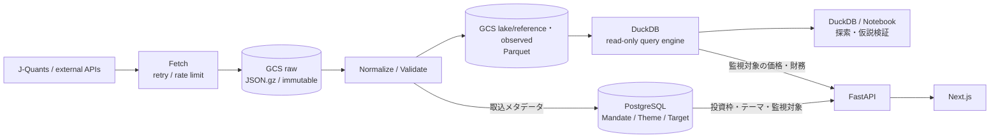

# 投資データ基盤の論理設計

## 位置づけ

この文書は**実装済みの論理データ層の境界と、その理由**を定めます。まだ実装していない層
（Assessment / Decision / Trigger / serving mart）の検討は、採用するまで公開しません。
物理スキーマの正本は
[Alembic migration](../../backend/migrations/versions/)、列定義の正本は
[`schema-data-dictionary.md`](schema-data-dictionary.md)です。

## 共通意思決定モデルとの対応

本プロジェクトは、個人開発全体で共通する
`Context → Observation → Assessment → Decision → Action → Outcome → Learn`の閉ループを、
投資判断へ具体化します。共通モデル自体はプロジェクト外で管理し、この文書では投資ドメイン固有の
対応と、共通モデルを実装可能なデータ責務へ分解した結果だけを定義します。

| 共通モデル | 投資判断プラットフォームでの対応 |
|---|---|
| Context | 投資方針、投資枠、目的、制約、判断主体、評価時点 |
| Observation | 株価、財務、開示、イベント、およびそれらの取得時点・来歴 |
| Derived | リターン、成長率、ボラティリティ、ファクター等の再計算可能な値 |
| Assessment | テーマ・銘柄・Evidenceのバージョン付き評価、予測、スコア |
| Decision | 採用、見送り、売買など、候補から何を選んだか |
| Action | 発注、取消、その他の実行指示と実行行為 |
| Outcome | 約定、損益、状態変化、仮説の事後的な帰結 |
| Learn | 予測・判断・結果の差を検証し、評価定義やルールを更新する処理 |

共通モデルは概念上の正本、コード・Alembic・この文書は投資プロジェクトで採用済みの実装上の正本です。
両者に差がある場合、共通モデルへ機械的に合わせて既存実装を変更せず、差分と移行要否を先に評価します。

## 設計原則

データを次の責務に分離します。

1. **Master** — 何を観測・分類・投資するか
2. **Observed** — 外部から取得し、内部形式へ正規化した一次観測
3. **Derived** — Observedから再計算可能な特徴量、リターン、リスク指標、ファクター
4. **Assessment** — 閾値・モデル・ルールによるバージョン付きの評価・解釈
5. **Decision** — Assessmentを踏まえた人またはシステムの意思決定
6. **Action** — 発注、取消、約定、入出金、手数料など実際に実行した行為
7. **Outcome** — リターン、制約充足、仮説の成否などAction後に観測された結果

外部提供者が加工した値でも、この基盤が外部入力として取得したものはObservedとします。
自基盤内で生成した値だけをDerivedとします。

### 評価・判断を観測Factへ混ぜない

Master、Observed、Derivedは、同じ入力と計算定義から同じ結果を再現できる基盤として設計します。
取得元、利用可能時点、取込実行、計算定義を追跡し、一次観測は上書きせず履歴を保持します。

一方、AssessmentとDecisionは唯一の正解を表すFactではありません。同じ銘柄・評価日でも、ルール、
モデル、パラメータが異なれば複数の評価と判断が成立します。**閾値や判定結果を
`investment_target`や`theme`へ持たせません。** 一度これを混ぜて剥がした経緯があり、
評価のルールを変えるたびにFactを作り直すことになります。

Assessment以降は独立した領域として追加し、次を満たす設計にします。

- ルール、モデル、プロンプト、パラメータをバージョン管理する
- `as_of_date`を保持し、その時点で利用可能だったデータだけを入力にする
- 結果を実行単位で追記し、過去の解釈を上書きしない
- 結果から入力Factと特徴量へ遡れるEvidenceを保存する
- Assessmentと、最終的な採用・却下・上書きであるDecisionを分離する
- FastAPIのRouterへ判定ロジックを持たせず、PipelineまたはServiceへ委譲する

## 保存先の責務分離

上の6層は**意味の境界**です。これとは別に、**保存先の境界**を持ちます。両者は独立しており、
同じObservedでも置き場所が分かれます。

| | PostgreSQL | GCS Parquet |
|---|---|---|
| 役割 | Operational（アプリケーション状態を管理する） | Observed / Analytical（履歴を蓄積して参照・分析する） |
| 置くもの | 投資枠、テーマ、監視対象、設定、取込メタデータ | 全市場の銘柄マスタ、価格・財務履歴、必要になったDerived・mart |
| アクセス | 参照と更新。整合性制約が効く | 追記中心。列指向でスキャンする |
| 実装状況 | 実装済み | 実装済み（銘柄マスタ、価格、財務。PBRは動的Derivedの実装例） |

**判定基準は「自分のデータか、外部データか」ではありません。** 外部由来でも、`data_source` や
「この銘柄を監視するか」のように**現在の状態を管理するもの**はPostgreSQLに置きます。逆に自分が
生成したデータでも、大量に追記して分析するだけのものはParquetが適します。

問うのは次の2点です。

1. **状態として管理し、更新し、整合性を保つ必要があるか** → PostgreSQL
2. **大量の履歴を追記し、横断して集計したいか** → Parquet

この分離により、PostgreSQLはWebアプリケーションが管理する状態へ限定できます。価格・財務などの
外部Observedは監視対象分も含めてGCS Parquetへ集約し、DuckDB経由で参照します。Assessment / Decision /
Outcomeを追加するときは、状態と関係を持つ本体をPostgreSQL側に置き、その計算入力・特徴量・大量履歴を
Parquet側に置きます。

なお**Parquetは正本ではありません**。原本はGCSへイミュータブルに保存したrawであり、Parquetは
rawから再生成できる状態を保ちます。

### 物理データフロー

価格・財務の本体はPostgreSQLへ蓄積せず、rawと正規化済みParquetをGCSへ保存します。DuckDBは永続化先ではなく、GCS上のParquetを読み取る
参照・分析エンジンとして利用します。FastAPIはPostgreSQLのアプリケーション状態とDuckDBの価格・財務を
API層で統合し、Next.jsへ同一の契約で提供します。

| 保存・実行先 | 責務 | 正本性 |
|---|---|---|
| GCS `raw/` | APIレスポンス原本、取得時点の証跡、再処理元 | 取得原本・証跡の正本 |
| GCS `lake/reference/` | 全上場銘柄の名称、市場、業種等の表示・結合用マスタ | rawから再生成可能な参照データセット |
| GCS `lake/observed/` | 型・識別子・時点を統一した全市場の価格・財務Parquet | rawから再生成可能な分析用データセット |
| GCS `lake/marts/` | 継続運用するAssessmentやDashboardで共有する高コストな派生データ | SQL定義から再生成可能。利用者が決まるまで作らない |
| PostgreSQL | 投資枠、テーマ、監視対象、ユーザー入力、関係、設定、取込メタデータ | アプリケーション状態の正本。全市場マスタ・価格・財務は持たない |
| DuckDB | Parquetの絞り込み、結合、集計 | 状態を持たない。正本にしない |
| FastAPI | PostgreSQLとDuckDBの結果をWeb向けAPI契約へ統合 | 保存先ではなく統合境界 |

画面表示では、PostgreSQLから投資枠、テーマ、投資対象、監視対象と外部識別子を取得し、その識別子と期間を
条件にDuckDBで`observed`の価格・財務を読みます。両データストアを直接JOINするのではなく、
FastAPIのService層が識別子を受け渡してレスポンスを構成します。RouterへSQLや分析ロジックを直接置かず、
PostgreSQLはRepository、DuckDBは分析Query Serviceへ委譲します。

rawのJSONやCSVを画面や分析から直接検索しません。分析は列指向のParquetを対象とし、銘柄別・日別の
細粒度ファイルを大量に作らず、データセットの特性に応じて年・月等でpartitionし、必要に応じて
compactします。頻繁に使う横断集計はリクエストごとに全履歴を走査せず、martsとして事前計算します。

### 古い経路を検証の足場として残した

PostgreSQLからParquet / DuckDBへの移行は置換ではなく、**読み出しの切り替えと書き込みの停止を
別の判断**として扱いました。先に古い経路を止めると、Parquetが正しいことを確認する足場が
無くなります。

DuckDBの集計結果をPostgreSQLの既存Observedと照合し、終値の乖離が中央値0.00%であることを
確認したうえで、観測テーブルを廃止しました（`0002_drop_observed_tables`）。照合用の
`reconcile_parquet.py`は、比較対象が無くなった後も構造の検査（重複キー、OHLCの大小関係、負値）
として残しています。

Parquetの公開に失敗してもrawから冪等に再実行できます。rawが原本で、Parquetは派生物だからです。

## 現行スキーマとの対応

| 論理層 | 現在の物理配置 |
|---|---|
| Master | GCS Parquet: `lake/reference/security_master`（全上場銘柄の外部マスタ）。PostgreSQL: `investment_target`（監視対象）、`watchlist_entry`（監視状態）、`theme`、`data_source`、`investment_target_identifier` |
| Context | PostgreSQL: `capital_allocation_mandate`／`mandate_version`（投資枠の目的と制約をversion管理）、`mandate_target_assignment`（枠内の目標配分）、`capital_budget_version`（総投資予算） |
| Observed | GCS Parquet: `lake/observed/market_price`, `lake/observed/financial_summary`。**PostgreSQL側のObservedテーブルは廃止済み**で、価格と財務はParquetからしか読みません |
| Derived | `backend/analytics/derived/*.sql`が計算定義の正本。`preferred_price`が取得元の採用規則を一元化し、`daily_return`と`point_in_time_pbr`はDuckDB／Notebookから動的に計算する |
| Assessment | 未実装。独立した評価領域として追加 |
| Decision | 未実装。Assessmentとは分離して追加 |
| Action | 未実装。注文・取消・約定等の実行Factとして追加 |
| Outcome | 未実装。Action後の損益・制約充足・仮説の成否として追加 |

関連指標、閾値、状態、構造判定、テーマとの意味的な関係は現在の物理スキーマに持たせません。
必要になった場合も、関連指標のObservedと、判断の定義・結果・Evidenceを別の責務として設計します。

## Derivedの規律

最新行を選ぶ前提として、各Derivedは期待粒度の一意性をテストします。`point_in_time_pbr`の期待粒度は
`security_key × as_of_date`です。一意性を保証できないDerivedで`ROW_NUMBER()`を使う場合は、
`as_of_date`だけに依存せず、開示日時・取込実行IDなど業務上意味のあるtie breakerを明示します。
同順位のどちらを採るかが実行ごとに変わるSQLを許容しません。

## 時間と来歴

時系列データでは、可能な範囲で次を区別します。

- `obs_date` / reference period — 値が表す対象日・対象期間
- `available_at` / disclosed time — 利用可能になった時点
- `fetched_at` — 基盤が取得した時点
- `ingestion_run_id` — 取得・変換・検証を実行した処理
- `source_id` — 取得元
- value type — actual、company forecast、consensus等

「過去・現在・未来」は固定属性として保存せず、評価時点と対象期間から導出します。
