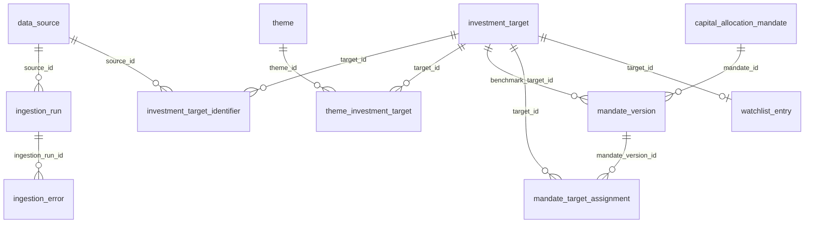

# スキーマ構造リファレンス（自動生成）

このファイルは `generate_schema_docs.py` が
[初期migration](../../backend/migrations/versions/0001_initial_postgresql.py) から生成します。
**直接編集しないでください。**

列の意味・由来・運用ルールは [`schema-data-dictionary.md`](schema-data-dictionary.md)、
論理層の設計方針は [`design-principles.md`](design-principles.md) を参照してください。

## テーブル一覧

| テーブル | 列数 | 主キー |
|---|---|---|
| `theme` | 7 | `theme_id` |
| `investment_target` | 8 | `target_id` |
| `data_source` | 8 | `source_id` |
| `ingestion_run` | 16 | `ingestion_run_id` |
| `ingestion_error` | 9 | `error_id` |
| `investment_target_identifier` | 10 | `investment_target_identifier_id` |
| `theme_investment_target` | 7 | `membership_id` |
| `capital_allocation_mandate` | 7 | `mandate_id` |
| `mandate_version` | 18 | `mandate_version_id` |
| `mandate_target_assignment` | 12 | `assignment_id` |
| `capital_budget_version` | 8 | `capital_budget_version_id` |
| `watchlist_entry` | 4 | `target_id` |

## テーブル間の関係

## テーブル定義

### `theme`

| 列 | 型 | NULL | 既定値 | 列挙値 |
|---|---|---|---|---|
| `theme_id` | BIGINT | NO | `AS` | - |
| `theme_key` | TEXT | NO | - | - |
| `theme_name` | TEXT | NO | - | - |
| `description` | TEXT | YES | - | - |
| `is_active` | BOOLEAN | NO | `TRUE` | - |
| `created_at` | TIMESTAMPTZ | NO | `CURRENT_TIMESTAMP` | - |
| `updated_at` | TIMESTAMPTZ | NO | `CURRENT_TIMESTAMP` | - |

- 主キー: `theme_id`

### `investment_target`

| 列 | 型 | NULL | 既定値 | 列挙値 |
|---|---|---|---|---|
| `target_id` | BIGINT | NO | `AS` | - |
| `target_key` | TEXT | NO | - | - |
| `target_name` | TEXT | NO | - | - |
| `target_type` | TEXT | YES | - | `individual_stock`, `etf`, `mutual_fund`, `bond` |
| `market` | TEXT | YES | - | - |
| `currency` | TEXT | YES | - | - |
| `created_at` | TIMESTAMPTZ | NO | `CURRENT_TIMESTAMP` | - |
| `updated_at` | TIMESTAMPTZ | NO | `CURRENT_TIMESTAMP` | - |

- 主キー: `target_id`
- テーブルCHECK: `target_type IS NULL OR target_type IN ( 'individual_stock', 'etf', 'mutual_fund', 'bond' )`

### `data_source`

| 列 | 型 | NULL | 既定値 | 列挙値 |
|---|---|---|---|---|
| `source_id` | BIGINT | NO | `AS` | - |
| `source_key` | TEXT | NO | - | - |
| `source_name` | TEXT | NO | - | - |
| `base_url` | TEXT | YES | - | - |
| `terms_url` | TEXT | YES | - | - |
| `is_active` | BOOLEAN | NO | `TRUE` | - |
| `created_at` | TIMESTAMPTZ | NO | `CURRENT_TIMESTAMP` | - |
| `updated_at` | TIMESTAMPTZ | NO | `CURRENT_TIMESTAMP` | - |

- 主キー: `source_id`

### `ingestion_run`

| 列 | 型 | NULL | 既定値 | 列挙値 |
|---|---|---|---|---|
| `ingestion_run_id` | BIGINT | NO | `AS` | - |
| `job_type` | TEXT | NO | - | - |
| `git_commit_sha` | TEXT | YES | - | - |
| `source_id` | BIGINT | NO | - | - |
| `status` | TEXT | NO | - | `running`, `succeeded`, `partial`, `failed` |
| `requested_from` | DATE | YES | - | - |
| `requested_to` | DATE | YES | - | - |
| `target_count` | INTEGER | NO | `0` | - |
| `fetched_count` | INTEGER | NO | `0` | - |
| `loaded_count` | INTEGER | NO | `0` | - |
| `skipped_count` | INTEGER | NO | `0` | - |
| `failed_count` | INTEGER | NO | `0` | - |
| `raw_path` | TEXT | YES | - | - |
| `error_message` | TEXT | YES | - | - |
| `started_at` | TIMESTAMPTZ | NO | `CURRENT_TIMESTAMP` | - |
| `finished_at` | TIMESTAMPTZ | YES | - | - |

- 主キー: `ingestion_run_id`
- 外部キー: `source_id` → `data_source`(`source_id`)
- インデックス `idx_ingestion_run_status`: `status`, `started_at`

### `ingestion_error`

| 列 | 型 | NULL | 既定値 | 列挙値 |
|---|---|---|---|---|
| `error_id` | BIGINT | NO | `AS` | - |
| `ingestion_run_id` | BIGINT | NO | - | - |
| `entity_type` | TEXT | YES | - | - |
| `entity_key` | TEXT | YES | - | - |
| `stage` | TEXT | NO | - | - |
| `error_type` | TEXT | YES | - | - |
| `error_message` | TEXT | NO | - | - |
| `retryable` | BOOLEAN | NO | `FALSE` | - |
| `created_at` | TIMESTAMPTZ | NO | `CURRENT_TIMESTAMP` | - |

- 主キー: `error_id`
- 外部キー: `ingestion_run_id` → `ingestion_run`(`ingestion_run_id`)
- インデックス `idx_ingestion_error_run`: `ingestion_run_id`

### `investment_target_identifier`

| 列 | 型 | NULL | 既定値 | 列挙値 |
|---|---|---|---|---|
| `investment_target_identifier_id` | BIGINT | NO | `AS` | - |
| `target_id` | BIGINT | NO | - | - |
| `source_id` | BIGINT | NO | - | - |
| `identifier_type` | TEXT | NO | - | - |
| `identifier` | TEXT | NO | - | - |
| `valid_from` | DATE | NO | `DATE` | - |
| `valid_to` | DATE | YES | - | - |
| `is_primary` | BOOLEAN | NO | `FALSE` | - |
| `created_at` | TIMESTAMPTZ | NO | `CURRENT_TIMESTAMP` | - |
| `updated_at` | TIMESTAMPTZ | NO | `CURRENT_TIMESTAMP` | - |

- 主キー: `investment_target_identifier_id`
- 一意キー: `source_id`, `identifier_type`, `identifier`, `valid_from`
- 外部キー: `target_id` → `investment_target`(`target_id`)
- 外部キー: `source_id` → `data_source`(`source_id`)
- テーブルCHECK: `valid_to IS NULL OR valid_to >= valid_from`
- インデックス `idx_investment_target_identifier_target`: `target_id`
- インデックス `idx_investment_target_identifier_lookup`: `source_id`, `identifier_type`, `identifier`

### `theme_investment_target`

| 列 | 型 | NULL | 既定値 | 列挙値 |
|---|---|---|---|---|
| `membership_id` | BIGINT | NO | `AS` | - |
| `theme_id` | BIGINT | NO | - | - |
| `target_id` | BIGINT | NO | - | - |
| `effective_from` | TIMESTAMPTZ | NO | `CURRENT_TIMESTAMP` | - |
| `effective_to` | TIMESTAMPTZ | YES | - | - |
| `created_at` | TIMESTAMPTZ | NO | `CURRENT_TIMESTAMP` | - |
| `updated_at` | TIMESTAMPTZ | NO | `CURRENT_TIMESTAMP` | - |

- 主キー: `membership_id`
- 外部キー: `theme_id` → `theme`(`theme_id`)
- 外部キー: `target_id` → `investment_target`(`target_id`)
- テーブルCHECK: `effective_to IS NULL OR effective_to >= effective_from`
- 一意インデックス `uq_theme_target_current_membership`: `theme_id`, `target_id` WHERE `effective_to IS NULL`
- インデックス `idx_theme_target_membership_history`: `theme_id`, `target_id`, `effective_from`

### `capital_allocation_mandate`

| 列 | 型 | NULL | 既定値 | 列挙値 |
|---|---|---|---|---|
| `mandate_id` | BIGINT | NO | `AS` | - |
| `mandate_key` | TEXT | NO | `( 'mandate-' || LPAD(nextval('capital_allocation_mandate_key_seq')::TEXT, 6, '0') )` | - |
| `mandate_name` | TEXT | NO | - | - |
| `status` | TEXT | NO | `'draft'` | `draft`, `active`, `suspended`, `retired` |
| `created_at` | TIMESTAMPTZ | NO | `CURRENT_TIMESTAMP` | - |
| `updated_at` | TIMESTAMPTZ | NO | `CURRENT_TIMESTAMP` | - |
| `demo_expires_at` | TIMESTAMPTZ | YES | - | - |

- 主キー: `mandate_id`
- インデックス `idx_public_demo_mandate_expiry`: `demo_expires_at` WHERE `demo_expires_at IS NOT NULL`

### `mandate_version`

| 列 | 型 | NULL | 既定値 | 列挙値 |
|---|---|---|---|---|
| `mandate_version_id` | BIGINT | NO | `AS` | - |
| `mandate_id` | BIGINT | NO | - | - |
| `version_no` | INTEGER | NO | - | - |
| `purpose` | TEXT | NO | - | - |
| `budget_amount` | NUMERIC(20, 2) | YES | - | - |
| `currency` | TEXT | YES | - | - |
| `expected_return` | DOUBLE PRECISION | YES | - | - |
| `max_drawdown` | DOUBLE PRECISION | YES | - | - |
| `horizon_months` | INTEGER | YES | - | - |
| `benchmark_target_id` | BIGINT | YES | - | - |
| `review_cycle` | TEXT | YES | - | `monthly`, `quarterly`, `semiannual`, `annual`, `ad_hoc`, `other` |
| `next_review_at` | DATE | YES | - | - |
| `effective_from` | TIMESTAMPTZ | NO | `CURRENT_TIMESTAMP` | - |
| `effective_until` | TIMESTAMPTZ | YES | - | - |
| `change_reason` | TEXT | YES | - | - |
| `created_at` | TIMESTAMPTZ | NO | `CURRENT_TIMESTAMP` | - |
| `review_cycle_custom` | TEXT | YES | - | - |
| `allocation_weight` | DOUBLE PRECISION | YES | - | - |

- 主キー: `mandate_version_id`
- 一意キー: `mandate_id`, `version_no`
- 外部キー: `benchmark_target_id` → `investment_target`(`target_id`)
- 外部キー: `mandate_id` → `capital_allocation_mandate`(`mandate_id`)（ON DELETE CASCADE）
- テーブルCHECK: `effective_until IS NULL OR effective_until >= effective_from`
- テーブルCHECK: `review_cycle IS NULL OR review_cycle IN ( 'monthly', 'quarterly', 'semiannual', 'annual', 'ad_hoc', 'other' )`
- テーブルCHECK: `(review_cycle = 'other' AND NULLIF(BTRIM(review_cycle_custom), '') IS NOT NULL) OR (review_cycle IS DISTINCT FROM 'other' AND review_cycle_custom IS NULL)`
- テーブルCHECK: `allocation_weight IS NULL OR (allocation_weight >= 0 AND allocation_weight <= 1)`
- テーブルCHECK: `allocation_weight IS NULL OR budget_amount IS NULL`
- 一意インデックス `uq_mandate_current_version`: `mandate_id` WHERE `effective_until IS NULL`

### `mandate_target_assignment`

| 列 | 型 | NULL | 既定値 | 列挙値 |
|---|---|---|---|---|
| `assignment_id` | BIGINT | NO | `AS` | - |
| `mandate_version_id` | BIGINT | NO | - | - |
| `target_id` | BIGINT | NO | - | - |
| `status` | TEXT | NO | `'active'` | `draft`, `active`, `suspended`, `retired` |
| `target_weight` | DOUBLE PRECISION | YES | - | - |
| `minimum_weight` | DOUBLE PRECISION | YES | - | - |
| `maximum_weight` | DOUBLE PRECISION | YES | - | - |
| `effective_from` | TIMESTAMPTZ | NO | `CURRENT_TIMESTAMP` | - |
| `effective_until` | TIMESTAMPTZ | YES | - | - |
| `rationale` | TEXT | YES | - | - |
| `created_at` | TIMESTAMPTZ | NO | `CURRENT_TIMESTAMP` | - |
| `updated_at` | TIMESTAMPTZ | NO | `CURRENT_TIMESTAMP` | - |

- 主キー: `assignment_id`
- 一意キー: `mandate_version_id`, `target_id`
- 外部キー: `mandate_version_id` → `mandate_version`(`mandate_version_id`)（ON DELETE CASCADE）
- 外部キー: `target_id` → `investment_target`(`target_id`)
- テーブルCHECK: `effective_until IS NULL OR effective_until >= effective_from`
- テーブルCHECK: `minimum_weight IS NULL OR maximum_weight IS NULL OR minimum_weight <= maximum_weight`
- テーブルCHECK: `target_weight IS NULL OR minimum_weight IS NULL OR target_weight >= minimum_weight`
- テーブルCHECK: `target_weight IS NULL OR maximum_weight IS NULL OR target_weight <= maximum_weight`
- インデックス `idx_mandate_assignment_target`: `target_id`
- 一意インデックス `uq_mandate_assignment_current`: `mandate_version_id`, `target_id` WHERE `effective_until IS NULL`
- インデックス `idx_mandate_assignment_history`: `mandate_version_id`, `target_id`, `effective_from DESC`

### `capital_budget_version`

| 列 | 型 | NULL | 既定値 | 列挙値 |
|---|---|---|---|---|
| `capital_budget_version_id` | BIGINT | NO | `AS` | - |
| `version_no` | INTEGER | NO | - | - |
| `total_budget` | NUMERIC(20, 2) | NO | - | - |
| `currency` | TEXT | NO | - | - |
| `effective_from` | TIMESTAMPTZ | NO | `CURRENT_TIMESTAMP` | - |
| `effective_until` | TIMESTAMPTZ | YES | - | - |
| `change_reason` | TEXT | NO | - | - |
| `created_at` | TIMESTAMPTZ | NO | `CURRENT_TIMESTAMP` | - |

- 主キー: `capital_budget_version_id`
- テーブルCHECK: `effective_until IS NULL OR effective_until >= effective_from`
- 一意インデックス `uq_capital_budget_current_version`: `(effective_until IS NULL)` WHERE `effective_until IS NULL`

### `watchlist_entry`

| 列 | 型 | NULL | 既定値 | 列挙値 |
|---|---|---|---|---|
| `target_id` | BIGINT | NO | - | - |
| `status` | TEXT | NO | - | `considering`, `monitoring`, `paused` |
| `created_at` | TIMESTAMPTZ | NO | `CURRENT_TIMESTAMP` | - |
| `updated_at` | TIMESTAMPTZ | NO | `CURRENT_TIMESTAMP` | - |

- 主キー: `target_id`
- 外部キー: `target_id` → `investment_target`(`target_id`)（ON DELETE CASCADE）
